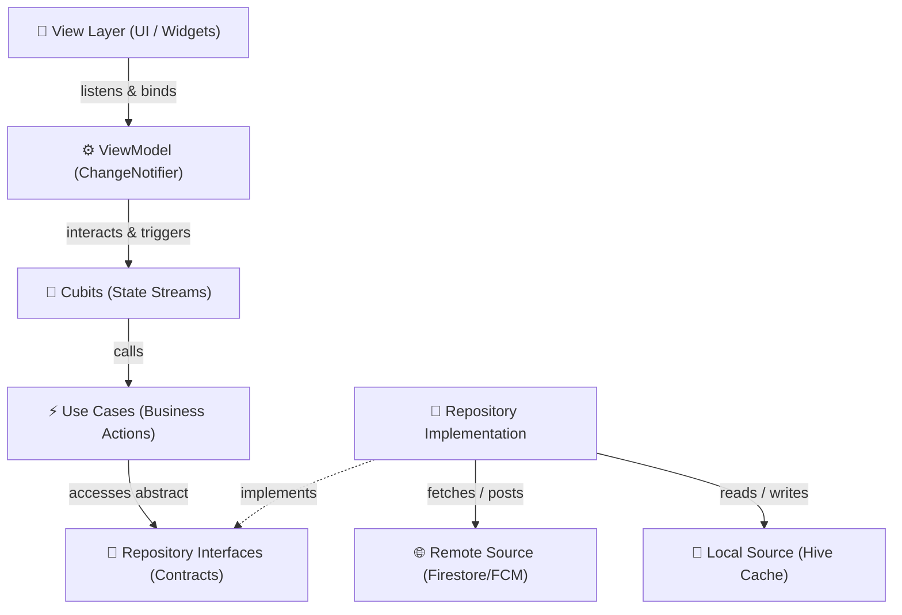

# 📱 Field Service Management App

<p align="center">
  
  
  
  
  
</p>

A next-generation, production-grade Field Service Management solution built using **Clean Architecture** and the **MVVM (Model-View-ViewModel)** presentation pattern. Empowered with reactive **BLoC/Cubit state management**, the system enables seamless real-time task allocations from Admins to Agents, offline-first progress logging, media capture uploads, and instant synchronization.

---

## 🚀 Key Features & Capabilities

| Module | Feature | Capability |
| :--- | :--- | :--- |
| 🔑 **Security** | Auth & Session | Secure Firebase Auth logins, session persistence, and instant logout confirmation. |
| 📋 **Task Engine** | Task Allocations | High-performance task creation, editing, status tracking, and priority tagging. |
| 📴 **Offline Sync** | Offline Resilience | Instant local cache (Hive) writes, a structured queue manager, and auto-sync on connectivity. |
| 🔔 **Alerts** | FCM Push Alerts | Instant task assignment foreground/background pushes with deep-linked navigation. |
| 📊 **Analytics** | Metrics Dashboard | Dynamic charts (fl_chart) showing status distribution and agent task completion status. |
| 🎨 **UI / UX** | Premium Design | Stunning dark-mode support, modern custom text inputs, and smooth transitions. |

---

## 🏗️ Architectural Blueprint

The application is structured into decoupled layers, enforcing the dependency rule: **inner layers have no knowledge of outer layers**.



### 🧱 Architectural Layer Breakdown

*   **`Domain Layer` (Independent Core)**: Defines structural entities, business execution protocols (`Use Cases`), and abstraction boundaries (`Repository Interfaces`). It contains no dependencies on external APIs or UI packages.
*   **`Data Layer` (Infrastructure & Details)**: Handles raw API communications (Firestore, Storage, FCM), manages the offline Hive box database caches, translates entity objects (`Mappers`), and fulfills domain repository contracts.
*   **`Presentation Layer` (MVVM & Reactive State)**:
    *   **Views / Pages**: Pure layouts that bind to ViewModels and listen to Cubit state emissions.
    *   **ViewModels (`ChangeNotifier`)**: Coordinate page life-cycles, manage UI controllers, perform local form validations, and call Cubit actions.
    *   **Cubits (`Cubit`)**: State streams that manage data flows (e.g. auth flows, tasks lists, sync queues) across views.

---

## 🛠️ Project Setup & Run Guide

### 📋 Prerequisites
*   [Flutter SDK](https://flutter.dev/docs/get-started/install) (version `>= 3.12.1` recommended)
*   CocoaPods (required for iOS runtime builds)
*   Active Android SDK / Xcode toolchain config

### ⚙️ Firebase Setup
Firebase configuration is fully mapped in [firebase_options.dart](lib/firebase_options.dart).

1.  Enable **Firebase Authentication** (Email & Password login provider).
2.  Set up **Cloud Firestore** and create the following collections:
    *   `users`: Documents mapped by user UID holding `name`, `email`, and `role` (e.g., `admin`, `agent`).
    *   `tasks`: Service tickets containing details, status (`Pending`, `In Progress`, `Completed`), and `assignedAgentId`.
3.  Enable **Firebase Storage** (for completion image uploads).

### 🚀 Running the Project
1.  Install packages and dependencies:
    ```bash
    flutter pub get
    ```
2.  Run the test suite (13 unit tests verifying Cubits and ViewModels):
    ```bash
    flutter test
    ```
3.  Launch the application:
    ```bash
    flutter run
    ```

---

## 🔄 Offline Synchronization & Conflict Management

### 📂 Offline Storage Strategy
*   All data queries yield locally cached Hive data first, ensuring instant startup times.
*   Task status changes or image captures are queued chronologically (`pendingStatusUpdatesBox`, `pendingPhotoUploadsBox`) and updated locally for immediate UI response.
*   Captured photos are cloned into the app's persistent document directory to protect them from temporary OS caches.

> [!TIP]
> **Conflict Resolution Model:**
> *   **Server Wins**: In the case of core task updates (title, description, details), Firestore updates immediately override local records.
> *   **Local Wins**: If a local action is in queue (status/photo updates), the local properties are preserved over incoming server updates until the queue syncs.

---

## ⚖️ Architectural Trade-offs & Assumptions

> [!IMPORTANT]
> **1. Prevent Offline Logins**
> *   **Decision**: Direct login attempts are rejected when the device is offline.
> *   **Trade-off**: Offline login is blocked to prevent mismatched user IDs (UIDs). Allowing offline fallbacks generates mock UIDs (e.g., `mock_uid_...`) which create duplicate user profiles (e.g., `Agent One` vs `AGENT1`) in Firestore and leads to empty/missing task lists due to ID mismatches. Already logged-in users are kept active via the local cache and can continue working offline.

> [!WARNING]
> **2. Client-Side FCM Triggering**
> *   **Decision**: Push notifications are posted directly from the Admin app client code.
> *   **Trade-off**: To ensure FCM security and prevent bundling Server Keys on client binaries, this trigger pipeline must be migrated to Firebase Cloud Functions or a secure backend system before a production release.

> [!NOTE]
> **3. Hand-written Hive Adapters**
> *   **Decision**: Hive adapters are written manually instead of using code generation (`hive_generator`).
> *   **Trade-off**: Manual writing requires maintaining model indexes, but it keeps the compiler dependency tree lightweight and prevents version conflicts between analyzer tools and unit test suites.